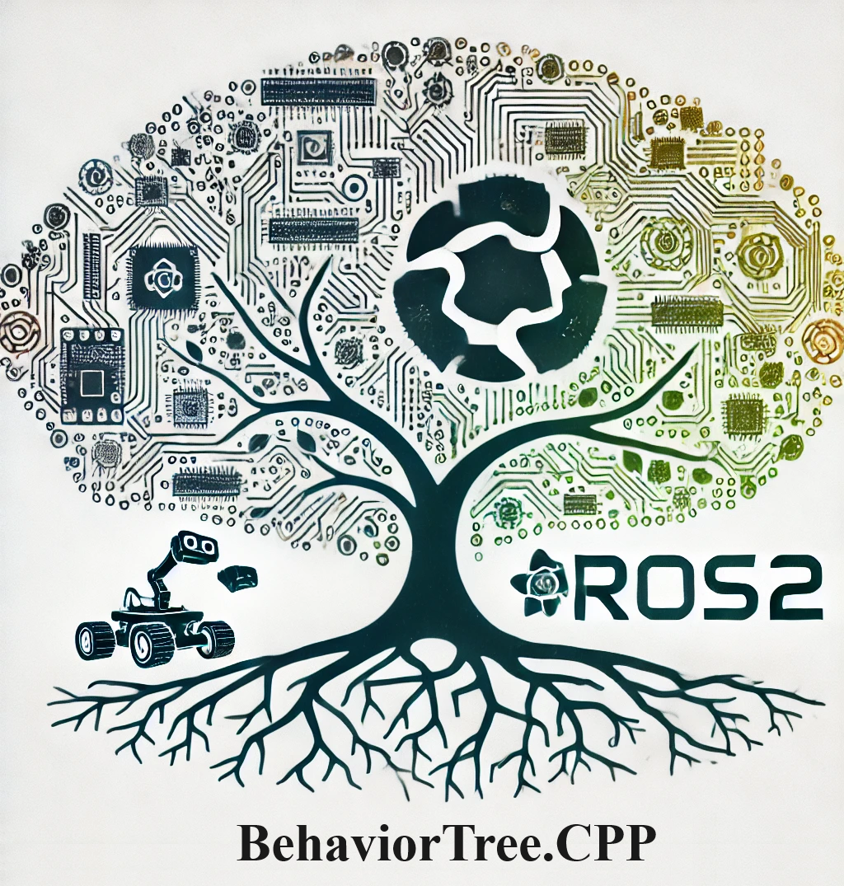

# BehaviorTree.CPP & ROS2 Jazzy Workspace

<p align="center">
  
</p>

## Overview

This workspace integrates both [BehaviorTree.CPP (BTCPP)](https://www.behaviortree.dev/) and [ROS2 Jazzy](https://docs.ros.org/en/jazzy/index.html), offering a robust environment for developing behavior trees and ROS2 applications. Behavior trees are widely used in AI, particularly in robotics and games, for managing complex decision-making processes. ROS2 (Robot Operating System 2) is a set of software libraries and tools for building robot applications.

## BehaviorTree.CPP

BehaviorTree.CPP is an open-source C++ library for building behavior trees. It offers a customizable and user-friendly framework supporting asynchronous actions, reactive behaviors, and integration with various middleware and libraries. For more information, visit the [official BehaviorTree.CPP website](https://www.behaviortree.dev/) or the [GitHub repository](https://github.com/BehaviorTree/BehaviorTree.CPP).

## ROS2 Jazzy

ROS2 Jazzy is the latest stable release of the Robot Operating System 2, providing reliable tools and libraries that are essential for robotics development. It improves upon previous versions with enhanced security, real-time performance, and cross-platform support. More details can be found on the [ROS2 website](https://docs.ros.org/en/jazzy/index.html).

## Docker-based Development Environment

This workspace includes a Docker environment tailored for developing with BehaviorTree.CPP and ROS2. It ensures a consistent setup across various systems and simplifies dependency management, making it easier to start developing and testing your applications immediately.

## Getting Started

To begin using this Docker-based environment, follow these steps:

1. Clone the repository:
    ```
    git clone https://github.com/mdirzpr/btcpp_ros2_ws.git
    ```

2. Build the Docker image:
    ```
    cd btcpp_ros2_ws
    docker compose build
    ```

3. Start a container:
    ```
    docker compose run btcpp_ros2
    ```

For more detailed instructions on working with Docker, refer to the [official Docker documentation](https://docs.docker.com/).

## Testing

### Testing BehaviorTree.CPP

Here are the steps to test the 'BehaviorTree.CPP' library separated for clarity:

1. Change to the Project Directory: Navigate to the directory containing the example project.
    ```
    cd src/BT_example/pick_place
    ```

2. Create a Build Directory: Set up a new directory for building the project. If it already exists, this command will have no effect.
    ```
    mkdir build
    ```

3. Enter the Build Directory: Move into the newly created build directory.
    ```
    cd build
    ```

4. Generate Makefiles: Run cmake to prepare the makefiles for building. This step configures the build environment.
    ```
    cmake ..
    ```

5. Compile the Project: Use make to compile the source code into an executable.
    ```
    make
    ```

6. Run the Executable: Execute the compiled binary to see the behavior tree in action.
    ```
    ./pickPlace
    ```

### Testing ROS2 Jazzy

To test ROS2, run the `demo_nodes_cpp` talker and listener nodes:

1. In one terminal, start the talker:
    ```
    ros2 run demo_nodes_cpp talker
    ```

2. In another terminal, start the listener:
    ```
    ros2 run demo_nodes_cpp listener
    ```

### Join the Community

For discussions, updates, and networking with other users of BehaviorTree.CPP and ROS2, consider joining the [BehaviorTree LinkedIn Group](https://www.linkedin.com/groups/13022577/).

### Developer and Maintainer
- [Mahdi Rezapour](https://github.com/mdirzpr)
- Email: mahdi.rezapour@smartfactory.de
